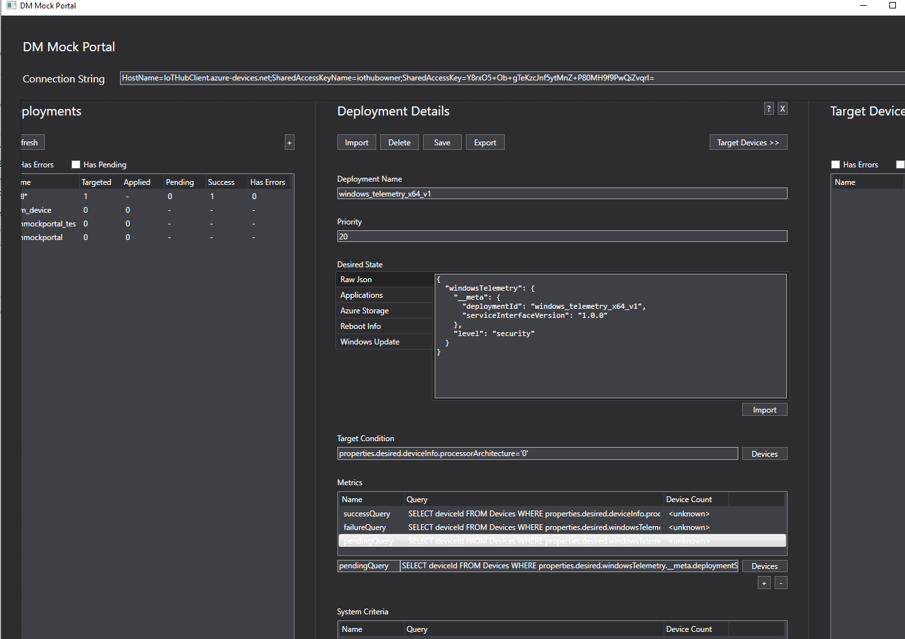

# DM Mock Portal

This tool allows the user to update devices individually or in bulk. It utilizes [Azure's ADM](https://docs.microsoft.com/en-us/azure/iot-hub/iot-hub-auto-device-config) service.

While you may find this tool useful, it was primary developed as a sample to show how an operator's flow might look like - specifically when it comes to bulk updates.

## Individual Update

- After inserting the iothubowner connection string, click `Refresh`.
- Select the `All` deployment.
- In the `Deployment Details` pane, click the `Target Devices` button.
- Select the device of your choice, and paste the JSON you want applied.

## Bulk Update

Bulk update is possible using this tool by specifying three different pieces:

1. The configuration to deploy (a JSON blob).
2. What criteria a device should satisfy to be a target of that configuration.
3. What criteria a device should satisfy to be considered successful in applying the configuration.

For example, let's say we want to set the telemetry level to `basic` for arm devices, while we want to set it to `security` for x64 device. To do that we will:

1. Define two configurations,

    - For x64
        <pre>
            "windowsTelemetry": {
              "__meta": {
                "deploymentId": "windows_telemetry_x64_v1",
                "serviceInterfaceVersion": "1.0.0"
              },
              "level": "security"
            }
        </pre>
    - For arm
        <pre>
            "windowsTelemetry": {
              "__meta": {
                "deploymentId": "windows_telemetry_arm_v1",
                "serviceInterfaceVersion": "1.0.0"
              },
              "level": "basic"
            }
        </pre>

2. Define the criteria a device should satisfy to get either of these configuration snippets. The criteria can be a simple condition or a compound one where device tags and/or properties are checked.
Deciding which tags/properties to use depends on how you are tagging your devices and what properties your devices are reporting - and which of those can be used to author the condition.

    For example, in our example here, we will use the `deviceInfo` `processorArchitecture` values to derive our conditions.

    - For x64, 
        <pre>
        properties.reported.deviceInfo.processorArchitecture='0'
        </pre>

    - For arm
        <pre>
        properties.reported.deviceInfo.processorArchitecture='5'
        </pre>

3. Lastly, define the criteria a device should satisfy to be considered successful in applying the condition. This has to be based on one or more reported properties as they reflect the state of the device.
Since we are setting `windowsTelemetry`, the Device Agent will respond after applying such configuration in the reported properties under a section named `WindowsTelemetry`.

    - For x64, 
        <pre>
        properties.reported.windowsTelemetry.__meta.deploymentStatus='succeeded' and properties.reported.deviceInfo.processorArchitecture='0'
        </pre>

    - For arm
        <pre>
        properties.reported.windowsTelemetry.__meta.deploymentStatus='succeeded' and properties.reported.deviceInfo.processorArchitecture='5'
        </pre>

    Note here that we included the "targeting" condition in the success condition. This is necessary so we scope our success result to the devices that are actually targeted by this deployment.

For the DMMockPortal, it expects three criteria to be defined for each deployment:

1. `successCondition`: defines how to know the deployment has succeeded.
2. `failureCondition`: defines how to know the deployment has failed.
3. `pendingCondition`: defines how to know the deployment is still in progress.

Now, typing those in the DMMockPortal can prove to be tricky. An easier way is to craft all these settings in a json file and import it into the DMMockPortal.
For example, we have [adm.windows_telemetry_x64_v1.json](adm.windows_telemetry_x64_v1.json) and [adm.windows_telemetry_arm_v1.json](adm.windows_telemetry_arm_v1.json) for your convenience.

### Walk-Through

- After inserting the iothubowner connection string, click `Refresh`.
- To create a deployment, click the `+`.
    - You can fill-in the form and then click `Save`. OR
    - You can import a pre-existing deployment profile by clicking `Import` then `Save`.
        - The repo comes with a set of pre-defined deployment profiles:

            - [adm.windows_telemetry_x64_v1.json](adm.windows_telemetry_x64_v1.json)
            - [adm.windows_telemetry_arm_v1.json](adm.windows_telemetry_arm_v1.json)

- Once a deployment is created (saved), the ADM service will pick it at some point (undeterministic) and apply it to the devices that satisfy the target condition.
- You can monitor their progress by hitting the `Refresh` button.

**Note 1**: Your device(s) must be running to be able to respond to the deployments.

**Note 2**: By default, we have device info and device schemas reported on start-up. This allows deployments to use their reported properties for targeting.

