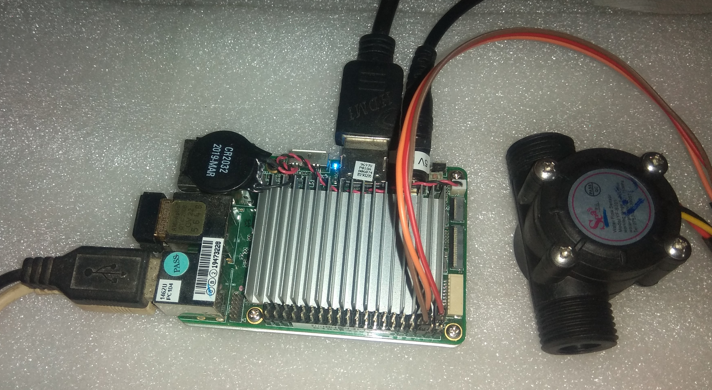

# Flow Volume

In this sample, we will demonstrate how to use a relatively inexpensive device and a Upboard to measure the volume of liquid flowing through a hose.

Keep in mind that the GPIO APIs are only available on Windows 10 IoT Enterprise, so this sample cannot run on your desktop.

## Set up your hardware
___
The hardware setup for this sample is relatively simple.

You’ll need a few components:

*   a Hall-effect flow sensor (we used a FL-S402B flow meter by DIGITEN)


*   a microcontroller board running Windows IoT Enterprise (we used a Upboard) with a free GPIO pin



### For Upboard

1.  Connect the red wire to 3.3V (pin 1 on the expansion header) on the Upboard.
2.  Connect the black wire to ground (pin 9).
3.  Connect the yellow wire, the data pin, to the GPIO-2 pin that we will read from (we used pin 7 for convenience, since it is right there between pins 1 and 9).
4.  Connect the monitor to your device (we used an HDMI cable to connect our Upbaord to a standard monitor).

For reference, here is the pinout of the Upboard:


## Deploy your app

1.  With the application open in Visual Studio, set the architecture in the toolbar dropdown. We use `x64` since we used the Upboard.

When everything is set up, you should be able to press F5 from Visual Studio. If there are any missing packages that you did not install during setup, Visual Studio may prompt you to acquire those now. 

### Generate an app package

Steps to follow :

 * In Solution Explorer, open the solution for your application project.
 * Right-click the project and choose Publish->Create App Packages (before Visual Studio 2019 version 16.3, the Publish menu is named Store).
 * Select Sideloading in the first page of the wizard and then click Next.
 * On the Select signing method page, select whether to skip packaging signing or select a certificate for signing. You can select a certificate from your local certificate store, select a certificate file, or create a new certificate. For an MSIX package to be installed on an end user's machine, it must be signed with a cert that is trusted on the machine.
 * Complete the Select and configure packages page as described in the Create your app package upload file using Visual Studio section.

 If you need guidance click Link: [here](https://docs.microsoft.com/en-us/windows/msix/package/packaging-uwp-apps#generate-an-app-package).  
  
### Install your app package using an install script

Steps to follow :
 * Open the *_Test folder.
 * Right-click on the Add-AppDevPackage.ps1 file. Choose Run with PowerShell and follow the prompts.
 * When the app package has been installed, the PowerShell window displays this message: Your app was successfully installed.

 If you need guidance click Link: [here](https://docs.microsoft.com/en-us/windows/msix/package/packaging-uwp-apps#install-your-app-package-using-an-install-script).  
  
 Click the Start button to search for the app by name, and then launch it.

 If you are using UPBOARD, you have to setup the BIOS GPIO configuration.

### BIOS Settings for UPBOARD

Steps to follow:
 
(1)	After power on the Upboard, Press Del or F7 to enter the BIOS setting.
 
(2)	Under the "Boot -> OS Image ID" Tab:
    Select "Windows 10 IoT Core".
 
(3)	Under the "Advance" Tab:
    Select "Hat Configuration" and Click on "GPIO Configuration in Pin Order".

(4) Configure the Pins you are using in the sample as "INPUT" or "OUTPUT".
    In this sample make Pin 2 as INPUT.

If you need guidance click Link: [here](https://www.annabooks.com/Articles/Articles_IoT10/Windows-10-IoT-UP-Board-BIOS-RHPROXY-Rev1.3.pdf).

The app will deploy and start on the Windows IoT device, and you should see a gauge control fill the screen.


The easiest way to test is to gently blow in one end of the flow meter.  The application listens for data coming from the device and the gauge should move up and back down as the flow rises and then stops.

Congratulations! You just measured the flow going through the sensor from your Windows IoT device.

## Let’s look at the code

The code for this sample is made easier by using a class to interface with such devices, found in Flow.cs.  This, in turn, is dependent upon a reusable class called Measurement, which is found in Models/Measurement.cs.

In order to understand how the code works, an explanation of the sensor device will help.  The device is based on the principle that a small wheel spins as there is flow through the sensor, which results in a certain number of pulses generated on the data pin.
By counting the number of pulses and multiplying by a factor, the volume flowing through the sensor can be calculated.  Because of variations in fluid density, and other subtle factors, it is important to calibrate the factor for your application.

### Timer code

Here is how you set up the application to use the Flow object in C#:

```csharp
public MainPage()
{
    this.InitializeComponent();

    // to change the calibration numbers, do it here to override the defaults within the code
    var calibration = new Dictionary<string, object>();
    calibration[Flow.FlowCalibrationFactorSetting] = "0.045";
    calibration[Flow.FlowCalibrationOffsetSetting] = "0";

    _flow = new Flow(calibration);
    _flow.FlowChanged += OnFlowChange;
    //_flow.Initialize();  // start without a timer, or ...
    _flow.Initialize(1000, 500); // start with a timer

    LastMeasurement = new Keg.DAL.Models.Measurement(0, Keg.DAL.Models.Measurement.UnitsOfMeasure.Ounces);
    LastMeasurement.PropertyChanged += OnAmountChange;
}
```
As you can see, we use a Dictionary object and add to it the values we want to use to calibrate the sensor's reported values.  Then we pass the Dictionary to the Flow object's constructor.  Finally, we call Initialize to allow the object
to setup internally.  Then we simply attach method references to the OnFlowChange event so that we get notified when readings are taken from the sensor.  The event provides to us a value that continues to increase that 
represents the cumulative volume measured by the sensor.  Since our user interface was implemented to display sort of a rolling average of the value of the sensor, we calculate the amount added since the last event and pass
that to the radial gauge control for display.

## Additional resources
* [Documentation for all samples](https://developer.microsoft.com/en-us/windows/iot/samples)

This project has adopted the Microsoft Open Source Code of Conduct. For more information see the Code of Conduct FAQ or contact <opencode@microsoft.com> with any additional questions or comments.

