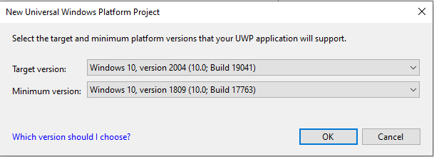
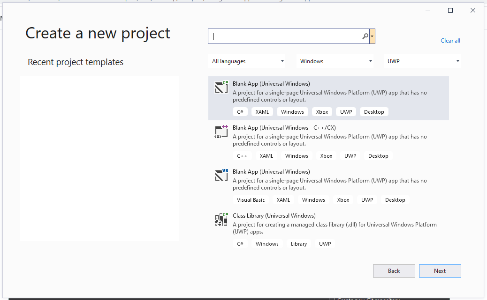

# Foreground App with Background App

In both versions of this sample (C++ or C#), the Background App can toggle a GPIO pin. 

## About this sample
If you want to create a solution that builds the foreground application and the background application into the same .APPX file it will require manual steps to combine the two projects.

## Step 1: Create a New project
1. Download [Visual Studio 2019](https://www.visualstudio.com/downloads/)
1. Navigate to **File** > **New** > Projec

## Step 2: Create a new Blank App

## Step 3: Select desired target version and click OK when prompted for target version

## Step 4: In Solution Explorer right-click on the solution and choose Add>New Project …

## Step 5: Create a new Background Application

## Step 6: Select desired target version and click OK when prompted for target version

## Step 7: In Solution Explorer right-click on the background application Package.appxmanifest and choose View Code

## Step 8: In Solution Explorer right-click on the foreground application Package.appxmanifest and choose View Code

## Step 9: Update App Manifest 

At the top of the foreground Package.appxmanifest add xmlns:iot="http://schemas.microsoft.com/appx/manifest/iot/windows10" and modify IgnorableNamespaces to include IoT.

        <Package
        xmlns="http://schemas.microsoft.com/appx/manifest/foundation/windows10"
        xmlns:mp="http://schemas.microsoft.com/appx/2014/phone/manifest"
        xmlns:uap="http://schemas.microsoft.com/appx/manifest/uap/windows10"
        xmlns:iot="http://schemas.microsoft.com/appx/manifest/iot/windows10"
        IgnorableNamespaces="uap mp iot">

## Step 10:	Copy the Extensions from Background to Foreground Application Package.appxmanifest

It should look like this:

        <Applications>
        <Application Id="App"
            Executable="$targetnametoken$.exe"
            EntryPoint="MyForegroundApp.App">
            <uap:VisualElements
            DisplayName="MyForegroundApp"
            Square150x150Logo="Assets\Square150x150Logo.png"
            Square44x44Logo="Assets\Square44x44Logo.png"
            Description="MyForegroundApp"
            BackgroundColor="transparent">
            <uap:DefaultTile Wide310x150Logo="Assets\Wide310x150Logo.png"/>
            <uap:SplashScreen Image="Assets\SplashScreen.png" />
            </uap:VisualElements>
            <Extensions>
            <Extension Category="windows.backgroundTasks" EntryPoint="MyBackgroundApplication.StartupTask">
                <BackgroundTasks>
                <iot:Task Type="startup" />
                </BackgroundTasks>
            </Extension>
            </Extensions>
        </Application>
        </Applications>

## Step 11: Add References to Foreground Application 

In Solution Explorer right-click on the Foreground Application References node and choose Add Reference

## Step 12: Add References to Background Application 

Add a project reference to the Background Application
 

## Step 13: Unload Project

In Solution Explorer right-click the foreground application project and choose Unload Project, then right-click the background application project and choose Unload Project.

## Step 14: Edit Foreground and Background App

1. In Solution Explorer right-click on the foreground application project and choose Edit MyForegroundApp.csproj and then right-click on the background application project and choose Edit MyBackgroundApp.csproj.
 

1. In the background project file comment the following lines:

        <!--<PackageCertificateKeyFile>MyBackgroundApplication_TemporaryKey.pfx</PackageCertificateKeyFile>-->
        <!--<AppxPackage>true</AppxPackage>-->
        <!--<ContainsStartupTask>true</ContainsStartupTask>-->

1. In the foreground project file add <ContainsStartupTask>true</ ContainsStartupTask> to the first PropertyGroup

        <PropertyGroup>
            <!-- snip -->
            <PackageCertificateKeyFile>MyForegroundApp_TemporaryKey.pfx</PackageCertificateKeyFile>
            <ContainsStartupTask>true</ContainsStartupTask>
        </PropertyGroup>

## Step 15: Reload Project

1. In Solution Explorer right-click on each project and choose Reload Project

1. In Solution Explorer delete Package.appxmanifest from the background application

1. At this point the project should build (and run the implementation you have added to the foreground and background applications).

## Step 16: [Generate an app package](https://docs.microsoft.com/windows/msix/package/packaging-uwp-apps#generate-an-app-package)

## Step 17: [Install your app package using an install script](https://docs.microsoft.com/windows/msix/package/packaging-uwp-apps#install-your-app-package-using-an-install-script)

## Step 18: BIOS GPIO Configuration

>[!NOTE]
>
> If you are using the [UP Board](https://up-board.org/up/specifications/), you will have to set up the BIOS GPIO configuration.

1. Configure the BIOS GPIO on the UP Board:

1. Once you power on the UP board, select the **Del** or **F7** key on your keyboard to enter the BIOS setting.

1. Navigate to **Boot** > **OS Image ID** tab, and select **Windows 10 IoT Core**.

1. Navigate to the **Advance** tab and select the **Hat Configuration** and select **GPIO Configuration in Pin Order**.

1. Configure the Pins you are using in the sample as **INPUT** or **OUTPUT**.

For more information, please review the [UP Board Firmware Settings.](https://www.annabooks.com/Articles/Articles_IoT10/Windows-10-IoT-UP-Board-BIOS-RHPROXY-Rev1.3.pdf)

## Additional Notes

Make sure that LowLevel Capabilities in set in PackageAppManifest.
* To do that go to Package.appxmanifesto and view the code
* Under Capabilities if you can find "DeviceCapability Name="lowLevel"/" then your lowLevel Capabilities is enabled.
* If this line "DeviceCapability Name="lowLevel"/" is not present then add it to enable the LowLevel mode and save the PackageAppManifest.
