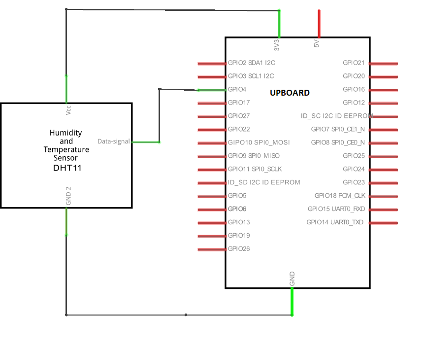
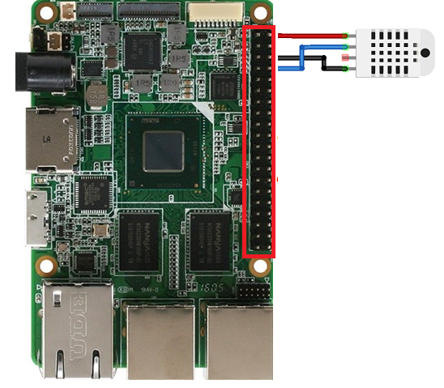

# GPIO OneWire DHT11/22 reader

| Minimum SDK Version | 19041 |
|---------------------|-------|
| Minimum OS Version  | 15063 |

This sample has been updated to use the `GpioChangeReader` API which is new as of build 19041. You must install SDK version 19041 or later to build this sample.

The sample has been temporarily modified to use two pins instead of one to drive the DHT22. `GpioChangeReader` requires interrupts to be enabled. 
`GpioPin.SetDriveMode()` currently takes much longer when interrupts are enabled than when they are disabled. 
If you try to change a pin from output to input when interrupts are enabled, you will miss the response from the DHT22.
As a workaround, two pins are used to interface with the DHT22.
One pin is configured as an output and is used to assert the data line LOW to request a sample. 
The other pin is configured as input and is used to capture changes on the data line.

Your breadboard should be wired as follows. You can use either a MOSFET(2N7000) or BJT transistor(2N3904). 
If you use a BJT(2N3904), be sure to put a resistor in series with the base of the transistor.


## GPIO OneWire DHT11 reader

Note what follows below is a bit out of date-  the latest version on GitHub is a 2 wire operation requiring pin 4 as input and pin 5 as output.

This sample shows how to read from the [DHT11](https://www.adafruit.com/product/386) from a Universal Windows Application. 
The DHT11 is a low cost temperature and humidity sensor that uses a single wire to interface to the host controller.
This wire is used by the host to request a sample from the DHT11 and by the DHT11 to transmit data back to the host.

The DHT11 is right on the edge performance-wise of what the GPIO APIs can handle. 
If there is background activity such as network, USB, filesystem, or graphics activity, it can prevent the sample from successfully sampling from the DHT11.

For a description of the protocol used by the DHT11, see [this article](http://embedded-lab.com/blog/?p=4333). 

The datasheet is [here](http://akizukidenshi.com/download/ds/aosong/DHT11.pdf).


### Requirements

{:.table.table-bordered}
| Minimum supported build | 10.0.10556                      |
|-------------------------|---------------------------------|
| Supported Hardware      | UP Board |

### Hardware Setup

You will need the following hardware to run this demo:

 * A [DHT11](https://www.adafruit.com/product/386) or [DHT22](http://www.adafruit.com/products/385) sensor
 * A couple of female-to-female connector wires

Connect the components as shown in the following diagram:




### Running the Solution

 1. Clone the Microsoft IoT Enterprise Repository and open GpioOneWire/GpioOneWire.vcxproj in Visual Studio 2019.
 2. Build the solution in Release x64 mode.

### [Generate an app package](https://docs.microsoft.com/windows/msix/package/packaging-uwp-apps#generate-an-app-package)

### [Install your app package using an install script](https://docs.microsoft.com/windows/msix/package/packaging-uwp-apps#install-your-app-package-using-an-install-script)

### BIOS Settings for UP Board
If you are using UP Board, you have to setup the BIOS GPIO configuration.
1. Once you power on the UP board, select the **Del** or **F7** key on your keyboard to enter the BIOS setting.
1. Navigate to **Boot** > **OS Image ID** tab, and select **Windows 10 IoT Core**.
1. Navigate to the **Advance** tab and select the **Hat Configuration** and select **GPIO Configuration in Pin Order**.
1. Configure the Pins you are using in the sample as **INPUT** or **OUTPUT**.
1. Select **Pin 4** as **INPUT** and **Pin 5** as **OUTPUT**
1. For more information, please review the [UP Board Firmware Settings](https://www.annabooks.com/Articles/Articles_IoT10/Windows-10-IoT-UP-Board-BIOS-RHPROXY-Rev1.3.pdf).
1. Click the Start button to search for the app by name, and then launch it.

### How it works

The logic that interacts with the DHT11 is contained in the Dht11::Sample() method. 
Since the 1s and 0s that the DHT11 sends back are encoded as pulse widths, we need a way to precisely measure the time difference between falling edges. 
We use [QueryPerformanceCounter()](https://msdn.microsoft.com/en-us/library/windows/desktop/ms644904(v=vs.85).aspx) for this purpose. 
The units of QueryPerformanceCounter are platform-dependent, so we must call [QueryPerformanceFrequency()](https://msdn.microsoft.com/en-us/library/windows/desktop/ms644905(v=vs.85).aspx) to determine the resolution of the counter.

A difference of 76 microseconds between falling edges denotes a '0', while a difference of 120 microseconds between falling edges denotes a '1'.
We choose 110 microseconds as a reasonable threshold above which we will consider bits to be 1s, while we will consider pulses shorter than this threshold to be 0s. We convert 110 microseconds to QueryPerformanceCounter (QPC) units to be used later.

```cpp
	HRESULT GpioOneWire::Dht11::Sample (GpioOneWire::Dht11Reading& Reading)
	{
		Reading = Dht11Reading();

		LARGE_INTEGER qpf;
		QueryPerformanceFrequency(&qpf);

		// This is the threshold used to determine whether a bit is a '0' or a '1'.
		// A '0' has a pulse time of 76 microseconds, while a '1' has a
		// pulse time of 120 microseconds. 110 is chosen as a reasonable threshold.
		// We convert the value to QPF units for later use.
		const unsigned int oneThreshold = static_cast<unsigned int>(
			110LL * qpf.QuadPart / 1000000LL);
``` 

Next, we send the sequence required to activate the sensor. 
The GPIO signal is normally pulled high while the device is idle, and we must pull it low for 18 milliseconds to request a sample. We latch a low value to the pin and set it as an output, driving the GPIO pin low.

```cpp
    // Latch low value onto pin
    this->pin->Write(GpioPinValue::Low);

    // Set pin as output
    this->pin->SetDriveMode(GpioPinDriveMode::Output);

    // Wait for at least 18 ms
    Sleep(SAMPLE_HOLD_LOW_MILLIS);
```

We then revert the pin to an input which causes it to go high, and wait for the DHT11 to pull the pin low, then high again.

```cpp
    // Set pin back to input
    this->pin->SetDriveMode(this->inputDriveMode);

    GpioPinValue previousValue = this->pin->Read();

    // catch the first rising edge
    const ULONG initialRisingEdgeTimeoutMillis = 1;
    ULONGLONG endTickCount = GetTickCount64() + initialRisingEdgeTimeoutMillis;
    for (;;) {
        if (GetTickCount64() > endTickCount) {
            return HRESULT_FROM_WIN32(ERROR_TIMEOUT);
        }

        GpioPinValue value = this->pin->Read();
        if (value != previousValue) {
            // rising edgue?
            if (value == GpioPinValue::High) {
                break;
            }
            previousValue = value;
        }
    }
```

After receiving the first rising edge, we catch all of the falling edges and measure the time difference between them to determine whether the bit is a 0 or 1.

```cpp
    LARGE_INTEGER prevTime = { 0 };

    const ULONG sampleTimeoutMillis = 10;
    endTickCount = GetTickCount64() + sampleTimeoutMillis;

    // capture every falling edge until all bits are received or
    // timeout occurs
    for (unsigned int i = 0; i < (Reading.bits.size() + 1);) {
        if (GetTickCount64() > endTickCount) {
            return HRESULT_FROM_WIN32(ERROR_TIMEOUT);
        }

        GpioPinValue value = this->pin->Read();
        if ((previousValue == GpioPinValue::High) && (value == GpioPinValue::Low)) {
            // A falling edge was detected
            LARGE_INTEGER now;
            QueryPerformanceCounter(&now);

            if (i != 0) {
                unsigned int difference = static_cast<unsigned int>(
                    now.QuadPart - prevTime.QuadPart);
                Reading.bits[Reading.bits.size() - i] =
                    difference > oneThreshold;
            }

            prevTime = now;
            ++i;
        }

        previousValue = value;
    }
```

After all bits have been received, we validate the checksum to make sure the received data is valid. The data is returned through the `Reading` reference parameter.

```cpp
    if (!Reading.IsValid()) {
        // checksum mismatch
        return HRESULT_FROM_WIN32(ERROR_INVALID_DATA);
    }

    return S_OK;
```

## Additional Notes

Make sure that LowLevel Capabilities in set in PackageAppManifest.
* To do that go to Package.appxmanifesto and view the code
* Under Capabilities if you can find "DeviceCapability Name="lowLevel"/" then your lowLevel Capabilities is enabled.
* If this line "DeviceCapability Name="lowLevel"/" is not present then add it to enable the LowLevel mode and save the PackageAppManifest.
