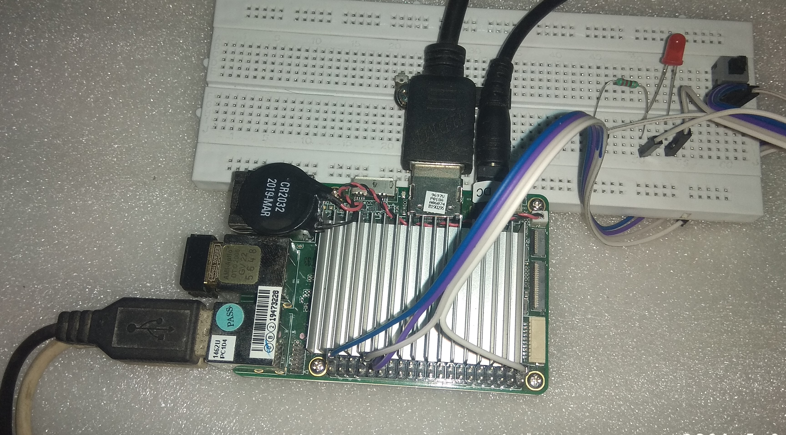
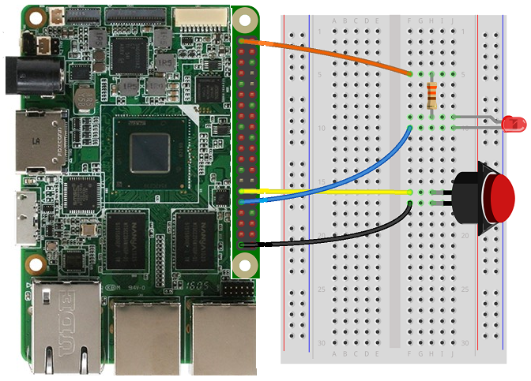

# Push button

In this sample, we connect a push button to your UP Board and use it to control an LED. We use GPIO interrupts to detect when the button is pressed and toggle the LED in response.



Also, be aware that the GPIO APIs are only available on boards, so this sample cannot run on your desktop.

## Components

You will need the following components:

* [EG1311-ND Tactile Button](http://www.digikey.com/product-detail/en/320.02E11.08BLK/EG1311-ND/101397)

* [Red LED](http://www.digikey.com/product-detail/en/C5SMF-RJS-CT0W0BB1/C5SMF-RJS-CT0W0BB1-ND/2341832)

* [330 &#x2126; resistor](http://www.digikey.com/product-detail/en/CFR-25JB-52-330R/330QBK-ND/1636)

* Breadboard and several male-to-male wires for the UP Board.

### Connect the circuit to your device

Let's start by wiring up the components on a breadboard.

#### UP Board

| Breadboard Diagram                                                                        | Schematic                                                                          |
| ----------------------------------------------------------------------------------------- | ---------------------------------------------------------------------------------- |
|       |  |


##### Connecting the LED

* Connect the cathode (the shorter leg) of the LED to Pin 31 (GPIO 11) of the UP Board

* Connect the anode (the longer leg) of the LED to one lead of the 330 &#x2126; resistor

* Connect the other end of the 330 &#x2126; resistor to Pin 1 (3.3V) on UP Board

##### Connecting the Push Button

* Connect one pin of the push button to Pin 29 (GPIO 10) of the UP Board

* Connect the other pin of the push button to one lead of the 330 &#x2126; resistor

* Connect the other end of the 330 &#x2126; resistor to ground

Here is the pinout of the UP Board


```csharp
private const int LED_PIN = 31;
private const int BUTTON_PIN = 29;
```

## Build and run the sample

1. Download a zip of all of our samples.
1. Open `samples-develop\PushButton\CS\PushButton.csproj` in Visual Studio.
1. If you have **UP Board**, Select `Release x64` for the target architecture.
1. Go to `Build -> Build Solution`.

### [Generate an app package](https://docs.microsoft.com/windows/msix/package/packaging-uwp-apps#generate-an-app-package)

### [Install your app package using an install script](https://docs.microsoft.com/windows/msix/package/packaging-uwp-apps#install-your-app-package-using-an-install-script)

### BIOS Settings for UP Board 

If you are using UP Board, you have to setup the BIOS GPIO configuration.

1. Once you power on the UP board, select the **Del** or **F7** key on your keyboard to enter the BIOS setting.

1. Navigate to **Boot** > **OS Image ID** tab, and select **Windows 10 IoT Core**.
	
1. Navigate to the **Advance** tab and select the **Hat Configuration** and select **GPIO Configuration in Pin Order**.

1. Configure the Pins you are using in the sample as **INPUT** or **OUTPUT**.

1. Set **PIN 31** as **OUTPUT** and **PIN 29** as **INPUT**.

1. For more information, please review the [UP Board Firmware Settings](https://www.annabooks.com/Articles/Articles_IoT10/Windows-10-IoT-UP-Board-BIOS-RHPROXY-Rev1.3.pdf).

1. Search for the app by name, and then launch it.

### Let's look at the code

First, we open the GpioPin resources we'll be using. The button is connected to GPIO10 in active LOW configuration, meaning the signal will be HIGH when the button is not pressed and the signal will go LOW when the button is pressed.

We'll be using the LED, connected to GPIO11, which is connected in active LOW configuration, meaning driving the pin HIGH will turn off the LED and driving the pin LOW will turn on the LED.

```csharp
buttonPin = gpio.OpenPin(BUTTON_PIN);
ledPin = gpio.OpenPin(LED_PIN);
```

We initialize the LED in the OFF state by first latching a HIGH value onto the pin. When we change the drive mode to Output, it will immediately drive the latched output value onto the pin. The latched output value is undefined when we initially open a pin, so we should always set the pin to a known state before changing it to an output. Remember that we connected the other end of the LED to 3.3V, so we need to drive the pin to low to have current flow into the LED.

```csharp
// Initialize LED to the OFF state by first writing a HIGH value
// We write HIGH because the LED is wired in a active LOW configuration
ledPin.Write(GpioPinValue.High); 
ledPin.SetDriveMode(GpioPinDriveMode.Output);
```

Next, we set up the button pin. For the UP Board, we take advantage of the fact that it has 
built-in pull up resistors that we can activate. We use the built-in pull up resistor so that we don't need to supply a resistor externally. 

```csharp
// Check if input pull-up resistors are supported
if (buttonPin.IsDriveModeSupported(GpioPinDriveMode.InputPullUp))
	buttonPin.SetDriveMode(GpioPinDriveMode.InputPullUp);
else
	buttonPin.SetDriveMode(GpioPinDriveMode.Input);
```

Next we connect the GPIO interrupt listener. This is an event that will get called each time the pin changes state. We also set the DebounceTimeout property to 50ms to filter out spurious events caused by electrical noise.

Buttons are mechanical devices and can make and break contact many times on a single button press. 

We don't want to be overwhelmed with events so we filter these out.

```csharp
// Set a debounce timeout to filter out switch bounce noise from a button press
buttonPin.DebounceTimeout = TimeSpan.FromMilliseconds(50);

// Register for the ValueChanged event so our buttonPin_ValueChanged 
// function is called when the button is pressed
buttonPin.ValueChanged += buttonPin_ValueChanged;
```

In the button interrupt handler, we look at the edge of the GPIO signal to determine whether the button was pressed or released. If the button was pressed, we flip the state of the LED.

```csharp
private void buttonPin_ValueChanged(GpioPin sender, GpioPinValueChangedEventArgs e)
{
	// toggle the state of the LED every time the button is pressed
	if (e.Edge == GpioPinEdge.FallingEdge)
	{
		ledPinValue = (ledPinValue == GpioPinValue.Low) ?
			GpioPinValue.High : GpioPinValue.Low;
		ledPin.Write(ledPinValue);
	}
```

We also want to update the user interface with the current state of the pin, so we invoke an update operation on the UI thread. Capturing the result of an async method in a local variable is necessary to suppress a compiler warning when we don't want to wait for an asynchronous operation to complete.

```csharp
// need to invoke UI updates on the UI thread because this event
// handler gets invoked on a separate thread.
var task = Dispatcher.RunAsync(CoreDispatcherPriority.Normal, () => {
	if (e.Edge == GpioPinEdge.FallingEdge)
	{
		ledEllipse.Fill = (ledPinValue == GpioPinValue.Low) ? 
			redBrush : grayBrush;
		GpioStatus.Text = "Button Pressed";
	}
	else
	{
		GpioStatus.Text = "Button Released";
	}
});
```

That's it! Each time you press the button, you should see the LED change state.
