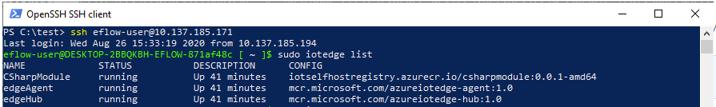

# Interop Console App with Linux Edge Module
## Progress

- [x] [Introduction](../README.md)   
- [x] [Step 1 - Setup Development Environment](./Setup%20DevVM.MD)   
- [x] [Step 2 - Setup Azure Resources](./Setup%20Azure%20Resources.MD)  
- [x] [Step 3 - Develop and publish the IoT Edge Linux module](./Develop%20and%20publish%20the%20IoT%20edge%20Linux%20module.MD)  
- [x] [Step 4 - Create Certificates for Authentication](./Create%20Certificates%20for%20Authentication.MD)  
- [x] [Step 5 - Develop the Windows C# Console Application](./Develop%20the%20Windows%20C%23%20Console%20Application.MD)  
- [x] [Step 6 - Configuring the IoT Edge Device](./Configuring%20the%20IoT%20Edge%20Device.MD)  
- [ ] **Step 7 - Deploy the Modules onto the IoT Edge Device**  
- [ ] [Step 8 - Run the Console Application](./Run%20the%20Console%20Application.MD)  
---

# Step 7: Deploy the Modules onto the IoT Edge Device
Having the IoT Edge device set up, we now deploy the Linux modules onto the device.

## Steps in the development VM

1. Perform the following steps from **Deploy Azure IoT Edge modules from Visual Studio Code** documentation.
    * [Sign in to access your IoT Hub](https://docs.microsoft.com/azure/iot-edge/how-to-deploy-modules-vscode#sign-in-to-access-your-iot-hub)  
    * [Deploy to your device](https://docs.microsoft.com/azure/iot-edge/how-to-deploy-modules-vscode#deploy-to-your-device)  
    (Select the file **deployment.amd64.json** from the **config** folder as manifest file to be deployed.)
      
    * [View modules on your device](https://docs.microsoft.com/azure/iot-edge/how-to-deploy-modules-vscode#view-modules-on-your-device) 

## Steps in the Linux environment of the IoT Edge Device
Using the Linux command shell that you signed into in [Step 6.2](./Configuring%20the%20IoT%20Edge%20Device.MD), run the following command to see the modules that have been deployed to your edge device.

    ```bash
    sudo iotedge list
    ```  
    
You should see the CSharpModule like the following:
   


Go to [Next Step](./Run%20the%20Console%20Application.MD)  
