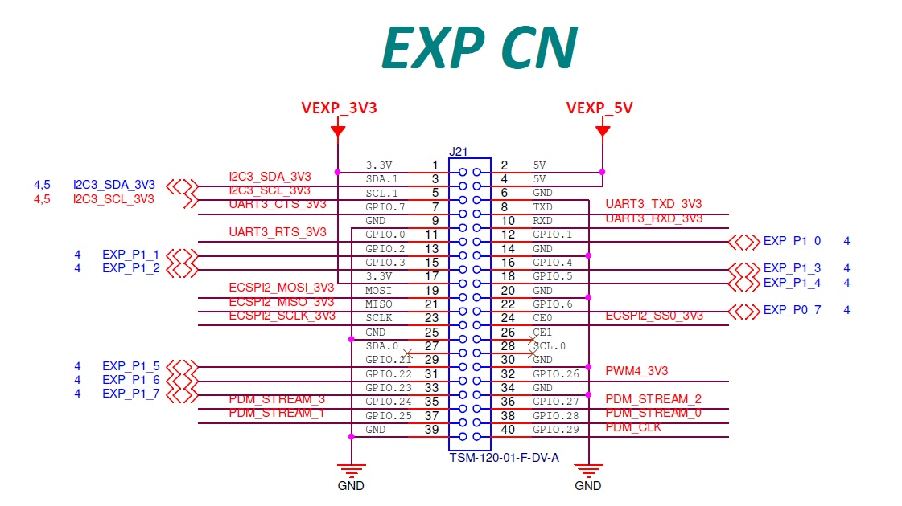

# NXP GPIO Sample Project

This project is a C# application developed in Visual Studio, designed to validate the GPIO pins on the NXP i.MX8M Plus board.

## Features

- **GPIO Communication**: The application uses the GPIO pins for communication.

- **GPIO Pin Control**: The application controls the state of the GPIO pins.

## Code Structure

The `MainPage` class is the core of the application. It includes methods for initializing the GPIO pins and controlling their state.

## Usage

To run this project, ensure that Visual Studio is installed on your machine. Open the `.sln` file in Visual Studio, build the solution, and run the project. 

To run this application on an NXP device, ensure that the NXP device is on the same network as your host machine and that Visual Studio remote tools are installed. Build this application for ARM64, set the debug mode to 'remote debug', and set the target machine to the IP address of the NXP device.

## Key Aspects of the Code

A crucial aspect of this code is the use of specific GPIO index numbers. These index numbers (155, 154, 147, 146, 141, 140, 139, 138, 137, 136, 88, 87, 86, 85, 84, 83) are used to access the GPIO pins on the NXP device. Any other index numbers would not work, as the GPIO pin indexes are unique to the hardware and software configuration of the NXP device.

## Measuring GPIO Pins

Once the application is running, you can measure the voltage levels of the GPIO pins on the NXP board using a multimeter. Connect the COM wire of the multimeter to the GND pin on the NXP board, and the V wire to each of the individual GPIO pins that you want to measure.

## Note

This project is designed to work with the specified GPIO pins on an NXP i.MX8M Plus board. Always ensure to follow the correct setup and connection procedures to avoid any hardware issues.