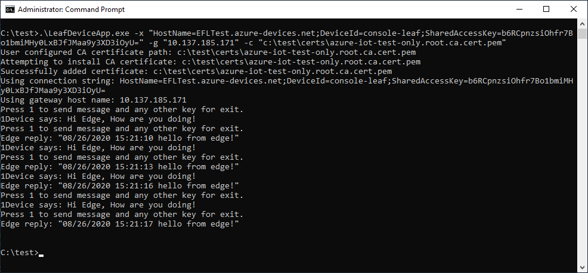

# Interop Console App with Linux Edge Module
## Progress

- [x] [Introduction](../README.md)  
- [x] [Step 1 - Setup Development Environment](./Setup%20DevVM.MD)   
- [x] [Step 2 - Setup Azure Resources](./Setup%20Azure%20Resources.MD)  
- [x] [Step 3 - Develop and publish the IoT Edge Linux module](./Develop%20and%20publish%20the%20IoT%20edge%20Linux%20module.MD)  
- [x] [Step 4 - Create Certificates for Authentication](./Create%20Certificates%20for%20Authentication.MD)  
- [x] [Step 5 - Develop the Windows C# Console Application](./Develop%20the%20Windows%20C%23%20Console%20Application.MD)  
- [x] [Step 6 - Configuring the IoT Edge Device](./Configuring%20the%20IoT%20Edge%20Device.MD)  
- [x] [Step 7 - Deploy the Modules onto the IoT Edge Device](./Deploy%20the%20Modules%20onto%20the%20IoT%20Edge%20Device.MD)  
- [ ] **Step 8 - Run the Console Application**  
---

# Step 8: Run the Console Application
We now deploy the Windows application onto the IoT device and run it to let it interoperate with the Linux modules.

1.  Change into the console application package folder previously copied to the Windows IoT device.
2.  Run the console application on the command prompt by running the below command.
    ```powershell
    .\LeafDeviceApp.exe -x "<leaf device connection string>" -g "<Linux VM IP address>" -c "<full path to root CA certificate>"
    ```
    Press <kbd>1</kbd> to send a message to the Linux module.

    You shoud see something like the following:

          
1. Run the below command to see the edge logs
    ```bash
    sudo iotedge logs CSharpModule
    ```
    You should see something like the following:
          
